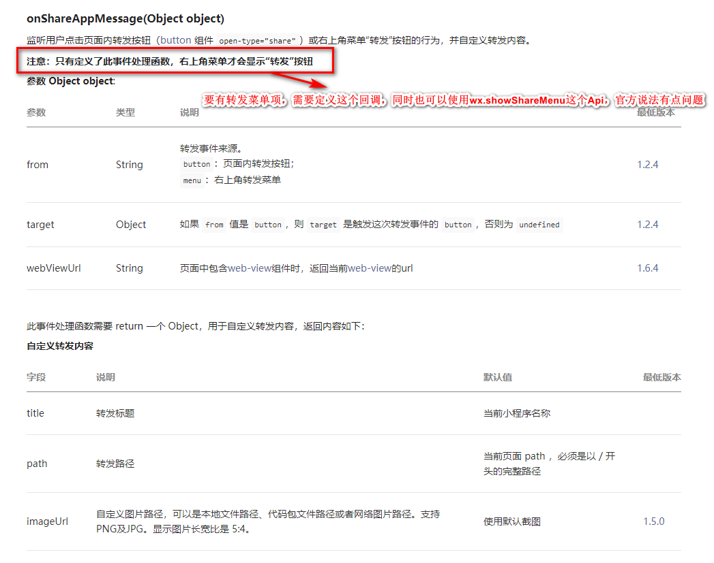

# CurrentTask
我的的任务
```
小程序:
	1. 微信登录
	2. 分享
	3. 支付
```
## 1. 微信小程序登录
微信小程序提供一个`wx.login`接口,通过这个接口我们就可以获取一个`code`具体使用流程如下：
---


### 1.1. 通过以下代码即可测试后端登录逻辑

> 为了使其他的微服务服务的无状态化，这里使用的`网关(Spring Cloud Zuul)`进行登录的处理
> 
```java
	application.yml
	
	weixin.appid=wxd894479b4519d1e3
	weixin.appsecret=cb10f34eaa920b1de50be2e0f4048d6e
	weixin.grant_type=authorization_code
	weixin.login_api=https://api.weixin.qq.com/sns/jscode2session?appid=${weixin.appid}&secret=${weixin.appsecret}&js_code=%s&grant_type=${weixin.grant_type}
	
	//---------------------------------------------------------------

	@Value("${weixin.login_api}")
    private String loginApiRAW;

    @GetMapping("/login")
    public String check(@RequestParam("code") String code){
        RestTemplate restTemplate = new RestTemplate();
        String loginApi = String.format(loginApiRAW, code);
        String body = restTemplate.getForEntity(loginApi, String.class).getBody();
        System.out.println("body = " + body);
        return body;
    }
```
> 调用微信api，可得到类似下面的信息：

```json
{
	"session_key":"DcCLjxQEL4KCSGyLJqvyig==",
	"openid":"obght5f5SkdacqQz-VBQygTj6AYk"
}
```

当登录成功后，我们通过下面的接口将数据发送这后台保存，`wx.getUserInfo`接口，通过该api调用我们可以获取一下信息:
以下字段都是不可信的信息，登录状态的确定要根据

字段名|字段含义
:-|:-
avatarUrl| 微信头像
city | 所在城市
country|所在国家
gender| 用户性别, 1 代表 男
language | 微信所用语言
nickName | 微信昵称
province | 户籍所在地

## 2. 微信小程序分享

小程序分享有两种方式：
* 页面右上方三个点，但是这里要通过`wx.showShareMenu`开启三个点的转发功能或在js逻辑页面中实现`onShareAppMessage`回调方法，也可以通过`wx.hideShareMenu`关闭该功能
* 另外就是通过`button`组件，设置`open-type="share"`就可以实现

转发时，我们可以在onShareAppMessage回调方法中实现我们的分享转发逻辑，
[官方说明](https://developers.weixin.qq.com/miniprogram/dev/reference/api/Page.html#onShareAppMessage-Object-object)


>微信小程序暂时未开放可以转发到朋友圈的接口，但是基于我们产品的功能，可以换一种方式实现。
>例如：在阅读报告中提供一个生成一个带二维码的图片报告。

## 3. 微信小程序支付
[有关可参考文档](https://www.cnblogs.com/yclimb/p/9952440.html)
<br>
[支付可用的sdk](https://github.com/YClimb/wxpay-sdk/blob/master/README.md)

[官方申请说明](http://kf.qq.com/faq/180910aYF77n18091073a6Jj.html)
### 第一步：准备好以下资料
1. 商户名称：微信支付显示的商户名；
2. 手机号码：用于接受微信支付相关信息；
3. 客服电话：微信支付的客服电话，将对外显示，可提供固话或手机号码；
4. 营业执照：营业执照扫描件或照片；
5. 身份证照片：运营人身份证正反面照片；
6. 银行账户：用于提现的银行账户；

### 第二步：联系客服开通
>以上资料准备好后，可直接联系微信支付服务商的在线工作人员，可快速开通微信支付功能，所需时间为三个工作日。
第三步：审核通过
工作人员审核资料并通过申请后，即可开通公司微信收款账号。
#### 注意事项：
1. 现在开微信支付不需要交2万押金了，但是微信官方需要收取0.6%的手续费。
2. 政府和媒体类型的订阅号可以开通微信小店，其他的必须是服务号才可以开。
3. 需要提供的资料：营业执照、身份证、微信名、联系方式、银行账户等，之后直接通过公众平台第三方 美基营销 帮忙开通，一般五天左右便可完成。企业、事业单位、社团、媒体等均可开通。
4. 如果之前是订阅号，也可以找第三方升级成服务号再开通微信支付功能。
5. 个体户如果有营业执照的话也有方法申请微信认证、微信支付，方法见上面第三条。
6. 个人用户无法开通官方的微信支付功能。